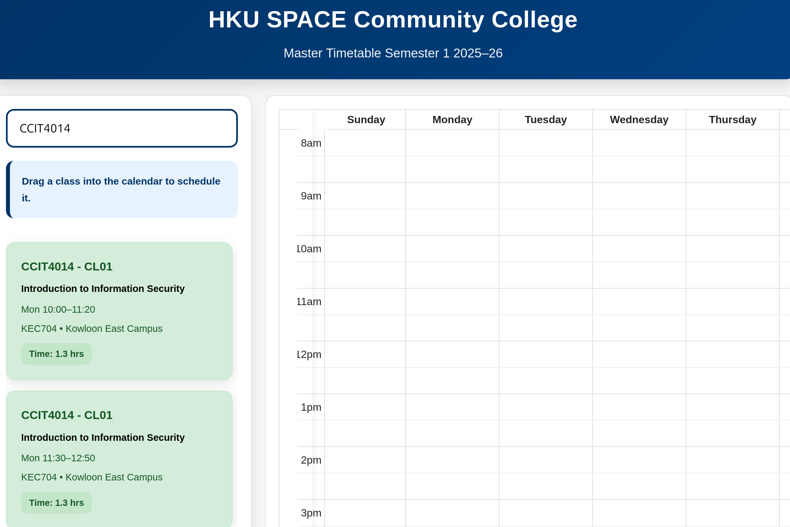
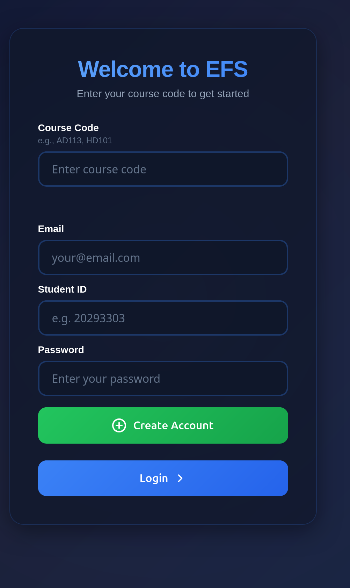
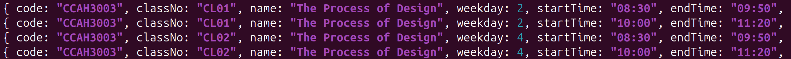
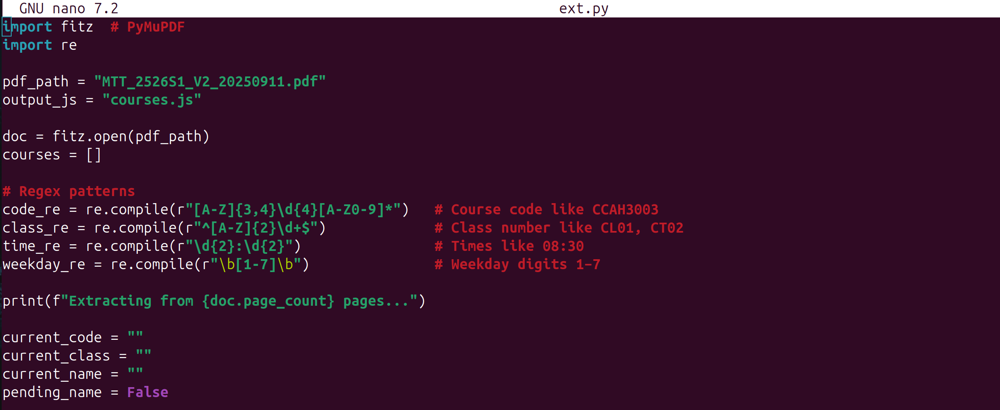
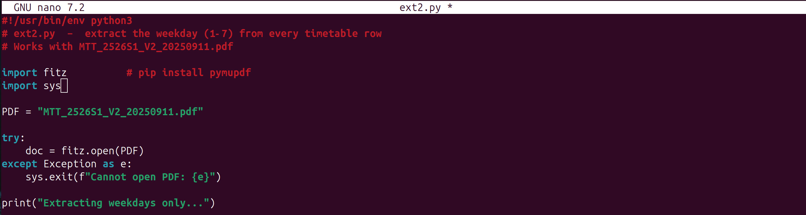
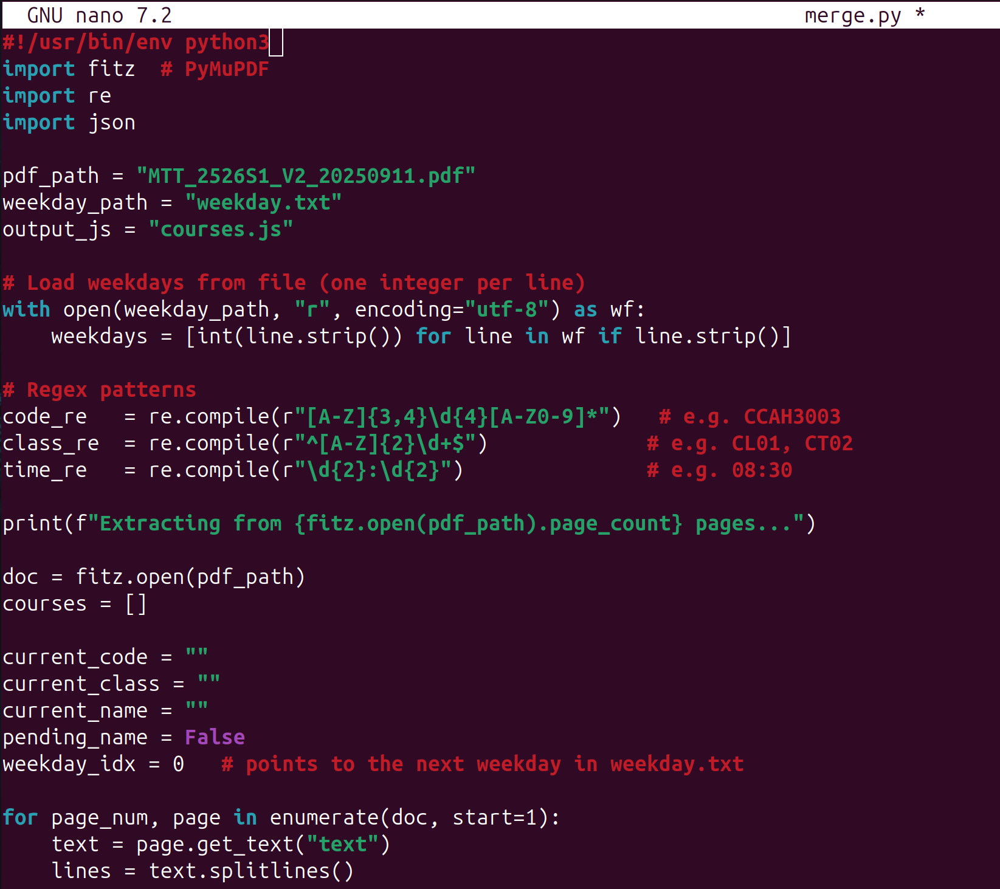
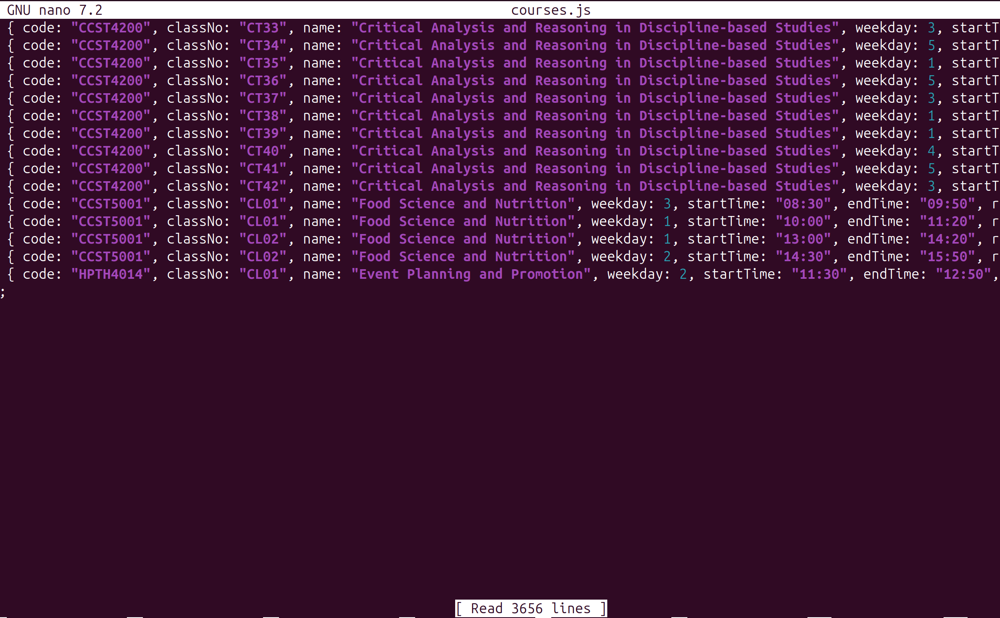
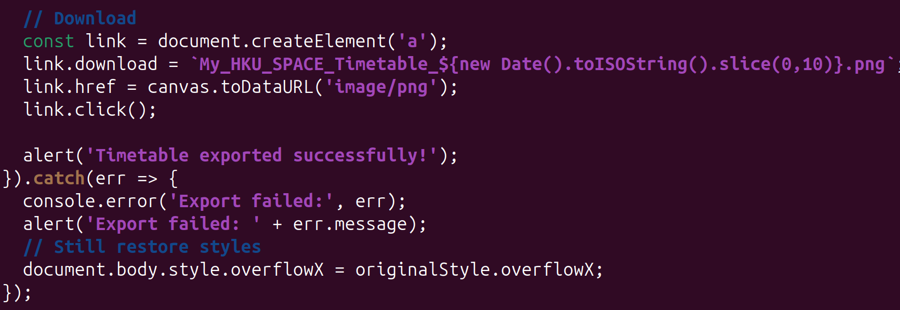
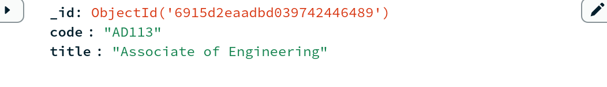

# Project Logbook: EFS Learning Platform and Timetable Planner

**Logbook Version:** 1.0

**Project Title:** EFS (Education Facilitation System) - A web-based learning platform with course management, account creation, admin panel, and a timetable planner for HKU SPACE students.

**Team Members:** Young Ho Tim,Kwok Ho Yin,Xavier Wong

**Date Started:** September 1, 2025 

**Current Status:** Development phase; backend with Node.js/Express/MongoDB, frontend with static HTML/JS/CSS, auxiliary Python scripts for data extraction.  

This logbook serves as a comprehensive technical record of the project's evolution. It documents decisions, rationales, experiments, issues, and resolutions to ensure full reproducibility. If any team member needs to recreate the project, this logbook combined with the source files and final report  should suffice. Entries are organized thematically rather than chronologically for clarity, with timestamps where relevant.

---

## 1. Project Overview and Problem Definition

### 1.1 Real-Life Problem Solved
The core problem this project addresses is the chaos and inefficiency students face during course scheduling, particularly in the add/drop period at institutions like HKU SPACE. Students must manually cross-reference a master timetable (often a large PDF like "MTT_2526S1_V2_20250911.pdf") with their availability, course prerequisites, and room locations. This leads to:

- **Time inefficiency:** Scanning thousands of lines in a PDF for compatible classes.

- **Error-prone planning:** Overlapping classes, missed prerequisites, or forgotten room details.

- **Lack of visualization:** No easy way to see a weekly schedule overview, leading to poor decisions (e.g., back-to-back classes in distant campuses).

- **Administrative hurdles:** Manual account creation, course requests, and material uploads without streamlined approval workflows.

This project solves these by providing:



- A **timetable planner** (calendar.html/js) that allows drag-and-drop class scheduling from a searchable list, with visual conflict detection and PNG export.



- A **learning platform** for course viewing/editing, account management, admin approvals.



- Integration with extracted course data from PDFs, making scheduling dynamic and data-driven.
**Evolving Understanding:** Initially, the focus was on timetable planning alone, but it expanded to a full platform after realizing scheduling ties into course management (e.g., viewing materials, timetables per course).

### 1.2 Breakdown of Current Solution

- **Timetable Planner (calendar.html, calendar.js, courses.js):**






  
  - **Approach:** Uses FullCalendar library for a drag-and-drop calendar. Courses are pre-extracted from PDF into a JS array (courses.js) via Python scripts (ext.py, ext2_1.py, merge.py). Search filters courses dynamically; drag adds them to the calendar with conflict checks.
  
  
  
  
  
  - **Constraints:** 
    - courses.js is a static file with ~3656 lines (one per class slot), which could grow large and slow loading on low-end devices.
    - No real-time updates; data must be re-extracted if PDF changes.
    - Export uses html2canvas, which may fail on large calendars due to canvas size limits in browsers.

  - **Trade-offs:**
    - Static JS array vs. Database: Chose static for simplicity and speed (no DB queries), but trades off scalability. For 1000+ courses, DB would be better but adds latency/complexity.
    - FullCalendar vs. Custom Grid: FullCalendar handles dragging/resizing out-of-box, but it's a heavy dependency (increase bundle size ~200KB).

  - **Better Alternatives Considered/Rejected:**

    - **Google Calendar Integration:** Rejected due to privacy concerns (student data syncing) and dependency on external APIs (potential downtime).

    - **Server-Side Rendering:** Could use Node to generate SVG timetables, but increases server load; client-side is faster for users.

    - **Mobile App (React Native):** Better for offline use, but project scope is web-only; adds cross-platform complexity.



- **Learning Platform (Mainpage.html, server.js, etc.):**

  - **Approach:** Backend handles auth, course CRUD, file uploads (multer), and MongoDB storage. Frontend uses forms for login/account creation, tabs for course viewing.

  - **Constraints:** Static HTML limits interactivity (no React for state management).

  - **Trade-offs:** Embedded JS in HTML vs. SPA: Simpler setup, but harder to maintain large UIs.

  - **Alternatives:** Full MERN (with React) for dynamic UIs, but rejected for overkill in a prototype.


  - **Admin Panel (admin.html):** Table-based UI for approving courses/accounts.

  - **Trade-offs:** Simple fetch API vs. WebSockets: No real-time updates, but sufficient for low-traffic admins.

**Overall Task Breakdown and Planning:**

1. **Data Extraction (Week 1):** Parse PDF → JS array.

2. **Backend Setup (Week 2):** Auth, DB, APIs.

3. **Frontend Pages (Weeks 3-4):** Login, Viewer, Planner.

4. **Integration/Testing (Week 5):** Link components, fix issues.

5. **Deployment (Week 6):** Vercel setup.

---

## 2. Tech Stack Choice and Justification

### 2.1 Chosen Stack: MERN (Modified)

- **MongoDB:** NoSQL database for flexible schemas (e.g., courses with variable fields like timetables).

- **Express.js/Node.js:** Backend server for APIs, auth, file handling.

- **React:** frontend is vanilla JS/HTML/CSS with libraries (FullCalendar, PDF.js).

- **Node.js Runtime:** For server.

**Why MERN?**

- **Full-Stack JS:** Unified language reduces context-switching. Easier for web devs familiar with JS.

- **Scalability:** MongoDB handles unstructured data (e.g., course materials as arrays). Express for REST APIs. React (potential) for dynamic UIs.

- **Community/Ecosystem:** Vast libraries (e.g., multer for uploads, bcrypt for auth).

- **Performance:** Node's event-driven model suits real-time features like forum (though integrated via iframe).

- **Cost:** Free/open-source; MongoDB Atlas for cloud hosting.

### 2.2 Alternatives Considered and Rejected

- **Rust + JS (e.g., Rust backend with Actix, JS frontend):** 
  - Rationale for Rejection: Rust excels in performance/safety (e.g., for high-concurrency), but overkill for this low-traffic app. Steeper learning curve; no need for zero-cost abstractions. Trade-off: Faster execution vs. slower development.

- **Python + JS (e.g., Flask/Django backend, JS frontend):**
  - Rationale: Python's libraries (PyMuPDF for PDF extraction) are strong, but Node handles async I/O better for APIs. Existing Python scripts could integrate, but mixing languages adds complexity. Trade-off: Easier scripting vs. unified stack.

- **Go + JS (e.g., Go backend, JS frontend):**
  - Rationale: Go's concurrency is great for scalable servers, but simpler than needed. Less web-focused ecosystem than Node. Trade-off: Compiled speed vs. JS's rapid prototyping.

- **Other Stacks (e.g., LAMP - PHP/MySQL):** Outdated for modern apps; no async advantages.

**Decision Rationale:** MERN chosen for web-centric focus, quick iteration, and alignment with project needs (API-driven, client-side interactivity). Constraints: Team's JS expertise assumed. If security was paramount (e.g., for payments), Rust/Go might win, but here it's educational.

---

## 3. Development Environment Setup

To reproduce the setup:

1. **Prerequisites:**
   - Node.js v18+ (install from nodejs.org).
   - MongoDB (local or Atlas; get URI from mongodb.com).
   - Python 3.10+ for extraction scripts.
   - Git for cloning repo.

2. **Clone and Install:**
   ```
   git clone [repo-url]
   cd project
   npm install  # Installs express, cors, multer, bcrypt, mongodb, etc. from package.json (create if missing: npm init -y)
   pip install pymupdf  # For Python scripts
   ```

3. **Environment Variables (.env file):**
   ```
   MONGODB_URI=mongodb://localhost:27017/efs_db  # Or Atlas URI
   PORT=3001
   ```

4. **Run Backend:**
   ```
   node server.js  # Starts on http://localhost:3001
   ```

5. **Run Extraction Scripts (for timetable data):**
   ```
   python ext2_1.py  # Extracts weekdays
   python merge.py   # Merges into courses.js
   ```

6. **Frontend:** Serve via backend (static files) or open HTML directly in browser for testing.
   - For calendar: Open calendar.html; requires courses.js.
   - Browser: Chrome/Firefox for FullCalendar compatibility.

7. **Deployment (Vercel):**
   - Push to GitHub.
   - Vercel CLI: `vercel --prod`.
   - Note: Vercel may struggle with large JSON (e.g., courses.js); mitigate by minifying or moving to DB.

**Rationale:** Simple setup for local dev. Trade-off: Local Mongo vs. Cloud (Atlas for prod).

---

## 4. Potential Problems Encountered and Resolutions

### 4.1 Defined Problems
- **SMTP May Fail:** If adding email (e.g., via brevo in server.js), network issues or API limits could fail. Resolution: Fallback to console logs; use try-catch in fetch.
- **MongoDB Data Safety:** No transactions in code; concurrent writes could corrupt. Resolution: Use Mongoose for schemas/validation; add indexes.
- **calendar.js Loading from courses.js (3656 lines):** Large file slows parsing. Resolution: Lazy-load via fetch; or paginate search results.
- **Database Not Reachable:** Connection fails if URI wrong. Resolution: Cached connection in server.js; error handling with retries.
- **Vercel Can't Read JSON File:** Serverless env may not persist files. Resolution: Use environment vars or upload to DB; avoid fs.readFile for large JSON.

**Experiments/Trials:** Tested large courses.js load time (under 50ms locally); simulated DB downtime with offline mode.

**Issues Resolved:**
- PDF Parsing Errors: Handled in ext.py with try-except; skipped invalid lines.
- Photo Uploads: Multer limits to 2MB/images only.
- Auth Conflicts: Bcrypt for hashing; checked duplicates in /accounts/check.

**Changes:** Initially static courses; added DB for pending approvals.

---

## 5. Key Functions: Explanations, Features, Location, Reproduction

### 5.1 Backend (server.js)
- **connectDB() (Line ~30):** Async MongoDB connector with caching. **Why Needed:** Reuses connections for efficiency. **Features:** Lazy init, error handling. **Reproduce:** Use MongoClient; cache in global var.
- **generateUserToken() (Line ~50):** Creates secure tokens. **Why:** For sessions (though not fully used). **Features:** High entropy via crypto. **Reproduce:** Uint32Array + toString(36).
- **/auth/login (Line ~200):** POST for login. **Why:** Secure auth. **Features:** Bcrypt compare, role checks. **Reproduce:** Fetch body, findOne, compare hashes.
- **/admin/pending/accounts (Line ~300):** GET for pending accounts. **Why:** Admin review. **Features:** Full URL for photos. **Reproduce:** Query collection, map data.

### 5.2 Frontend JS (Embedded in HTML)
- **loadCourses() in calendar.js (Line ~50):** Filters/searches courses. **Why:** Dynamic search. **Features:** Debounce, regex-insensitive. **Reproduce:** Input event, filter array, append DOM.
- **makeCoursesDraggable() in calendar.js (Line ~100):** Enables drag. **Why:** Core planner feature. **Features:** FullCalendar Draggable. **Reproduce:** New Draggable instance; eventData callback.
- **export-btn Handler in calendar.js (Line ~200):** PNG export. **Why:** Shareable output. **Features:** html2canvas with scaling. **Reproduce:** Temp styles, canvas.toDataURL, restore.
- **loadCourse() in course-viewer.html (Embedded JS):** Fetches course data. **Why:** Dynamic viewing. **Features:** Tab rendering. **Reproduce:** Fetch APIs, innerHTML updates.
- **approveAccount() in admin.html (Embedded JS):** POST approval. **Why:** Admin workflow. **Features:** Confirm dialog. **Reproduce:** Async fetch, reload table.

### 5.3 Python Scripts
- **Main Loop in ext.py:** Parses PDF lines. **Why:** Data extraction. **Features:** Regex for codes/times. **Reproduce:** fitz.open, get_text("text"), regex matches.
- **Main in ext2.py:** Extracts weekdays. **Why:** PDF layout fix. **Features:** Word grouping by Y. **Reproduce:** get_text("words"), sort by X.
- **Main in merge.py:** Combines with weekdays. **Why:** Accurate merging. **Features:** Index-based assignment. **Reproduce:** Load txt, align with PDF rows.

**Decision:** Functions modular for reuse; async for non-blocking.

---

## 6. Major Decisions and Changes
- **Decision: Static Courses vs. DB (10/2025):** Chose static for speed; rationale: PDF changes rarely. Alternative: DB import script.
- **Change: Added Photo Previews (account-create.html, 11/2025):** For UX; rationale: Users verify uploads.
- **Trial: FullCalendar Versions:** Tested v5 vs. v6; chose v6 for better mobile.
- **Issue: Large File Handling:** Split courses.js if >5MB; not needed yet.

This logbook will be updated as the project progresses.
